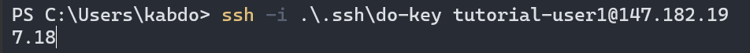

# Linux Tutorial #
#### By Kian Abdollahi, Set C ####

## This tutorial will cover the following: ##
1. How to create a new regular user that has administrative 
privileges, a password, bash login shell, and SSH access to server

2. How to prevent the root user from connecting to the server via SSH

3. How to install nginx 

4. How to configure nginx to serve a sample website

## Section 1: Creating new regular user ##
Connect to your droplet via root to begin this tutorial

### Create regular user <tutorial-user1> ###

```bash
useradd -ms /bin/bash tutorial-user1
```
#### The -m creates a home directory for the new user automatically, the -s takes an argument for the users default shell. In this case we are seting the default login shell to /bin/bash. The users name is tutorial-user1 ####

### Give user <tutorial-user1> a password ###

```bash
passwd tutorial-user1
```


### Add user to sudo group ###

```bash
usermod -aG sudo tutorial-user1
```
#### This command will add user <tutorial-user1> to the group sudo, giving them elevated privileges. The -a flag means append, so it will append the user to the group instead of removing them from all other groups. The -G is used to specify the group to add to. ####

### Allow user to access server via ssh ###

#### Copy .ssh directory from the root users home directory to new users home directory ####

```bash
cp -r .ssh/ /home/tutorial-user1/
```

#### This copies recursively the .ssh/ folder and its contents from the root home directory to the new users home directory. Replace with the name of your user. ####


### Change ownership of .ssh folder to new user ###

```bash
chown -R tutorial-user1:tutorial-user1 .ssh/
```

#### This changes the ownership of the .ssh/ directory to the new user. The -R means recursive, and will change ownership of folder and all contents. ####


### Test you can connect with new user ###

```bash
ssh -i .\.ssh\do-key tutorial-user@147.182.197.18
```
    
#### If you can successfully access your server using the new user, you have succeeded. If you get a permission denied, something went wrong. ####



## Section 2: Edit ssh configuration so can no longer connect via root ###

### Locate the sshd_config file located in /etc/ssh ###
    


### Edit the sshd_config file so that you can no longer permit root login via SSH (Use sudo if not root) ###

```bash
vim sshd_config
```

#### Search the file for the line "PermitRootLogin" ####


#### Change the "yes", to "no" ####

### Restart the .ssh service to refresh the configuration ###

```bash
systemctl restart ssh.service
```   


### Test that you can no longer connect to the root via ssh. You should see a permissions denied message if you succeeded. ###


## Section 3: How to install nginx ##

### Update the package manager ###
```bash
sudo apt update
```


### Install nginx ###
```bash
sudo apt install nginx
```
### Check the service is running ###
```bash
systemctl status nginx
```
#### Make sure the service is active and running ####


## Section 4: How to configure nginx to serve a webpage ##

### Create an index.html file in /var/www/my-site ###

#### Move into the correct folder ####
```bash
cd /var/www 
```
#### Create a directory named "my-site" ####
```bash
sudo mkdir my-site
```

#### Inside this new directory, create a file index.html ###
```bash
sudo vim index.html 
```

#### Paste the following html content in the index.html file and save it ####
```html
    <!DOCTYPE html>
    <html lang="en">
    <head>
        <meta charset="UTF-8">
        <meta name="viewport" content="width=device-width, initial-scale=1.0">
        <title>2420</title>
        <style>
            body {
                display: flex;
                align-items: center;
                justify-content: center;
                height: 100vh;
                margin: 0;
            }
            h1 {
                text-align: center;
            }
        </style>
    </head>
    <body>
        <h1>Hello, World</h1>
    </body>
    </html>
```
### Now move to the folder /etc/nginx/sites-available ###
```bash
cd /etc/nginx/sites-available/
```

### Create a new file "my-site.conf" in this folder ###
```bash
sudo vim my-site.conf
```

### Paste the following configuration code into the file and save it ###

```bash
server {
        listen 80;

        root /var/www/my-site;

        index index.html index.htm;

        server_name _;

        location / {
                # First attempt to serve request as file, then
                # as directory, then fall back to displaying a 404.
                try_files $uri $uri/ =404;
        }
}
```
### Now move to the /etc/nginx/sites-enabled folder ###
```bash
cd /etc/nginx/sites-enabled
```

#### Remove the symbolic link "default" in the folder ####
```bash
sudo rm default
```

### Create a symbolic link to the configuration file you just made in this folder ###
```bash
ln -s /etc/nginx/sites-available/my-site.conf my-site
```

#### Check there are no issues with the symbolic link and configuration file ####
```bash
sudo nginx -t
```

#### You should hopefully see the following ####


### Now restart the nginx service for new congiguration to take effect ###
```bash
sudo systemctl restart nginx
```

### You should now be able to test whether nginx is serving the html file ###

#### Open your browser and type the ip address of your droplet ####
If you see the contents of the html file then success !